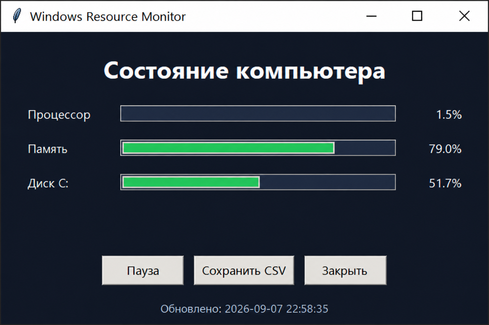

# Python Freelance Portfolio

Три законченных проекта на Python для автоматизации повседневных задач в Windows. Все программы работают без сторонних библиотек, содержат инструкции запуска, обработку ошибок и проверяемый демонстрационный сценарий.

## Проекты

| Проект | Результат для пользователя | Что показывает в коде |
|---|---|---|
| [Windows Resource Monitor](resource-monitor/) | Окно с текущей загрузкой CPU, памяти и диска; история сохраняется в CSV | Tkinter, Windows API, состояние интерфейса |
| [Safe File Organizer](file-organizer/) | Сортировка файлов по категориям с предпросмотром и отменой | pathlib, JSON, безопасные файловые операции, unittest |
| [CSV Report Generator](csv-report/) | Автономный HTML-отчёт с профилем столбцов и предпросмотром данных | csv, определение кодировки, статистика, HTML-экранирование |

## Демонстрация

### Windows Resource Monitor



Для CSV Report Generator в репозитории лежат [исходные данные](csv-report/demo/sales.csv) и [готовый HTML-отчёт](csv-report/demo-report.html). File Organizer по умолчанию работает в безопасном режиме: сначала печатает план и ничего не перемещает.

## Быстрый запуск

Требования: Windows 10/11 и Python 3.10 или новее. Команды выполняются из корня репозитория.

```powershell
# Оконный монитор
py -3 resource-monitor/app.py

# Предпросмотр сортировки без изменения файлов
py -3 file-organizer/organizer.py "$env:USERPROFILE\Downloads"

# Создание HTML-отчёта
py -3 csv-report/report.py csv-report/demo/sales.csv --output csv-report/demo-report.html
start csv-report/demo-report.html
```

## Проверка качества

```powershell
powershell -ExecutionPolicy Bypass -File .\run_checks.ps1
```

Сценарий проверяет синтаксис трёх программ, запускает автоматические тесты и заново создаёт демонстрационный отчёт. Успешный результат заканчивается строкой `All checks passed.`

## Документация

- [Описание проектов и навыков](PORTFOLIO.md)
- [Тексты услуг для фриланс-профиля](FREELANCE_PROFILE.md)
- `Руководство по программам Python-портфолио.docx` — подробный разбор для начинающего разработчика

## Что я отрабатываю в этих проектах

- декомпозицию задачи на небольшие функции и классы;
- безопасную работу с пользовательскими файлами;
- понятный интерфейс командной строки и GUI;
- обработку ожидаемых ошибок;
- автоматические тесты и воспроизводимую проверку перед публикацией.
